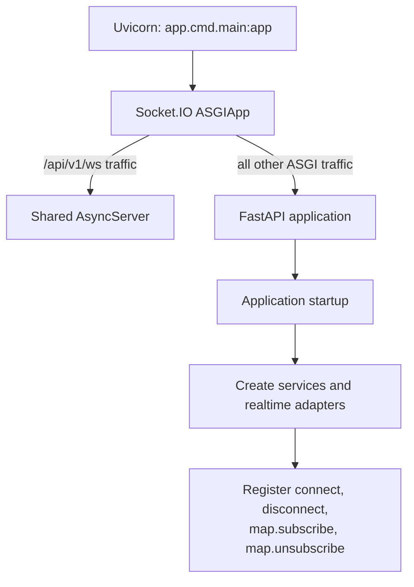
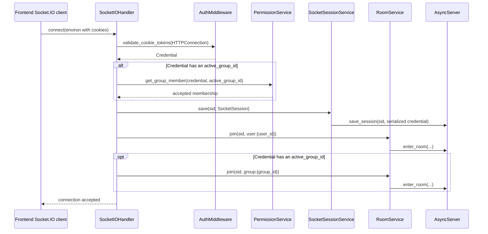
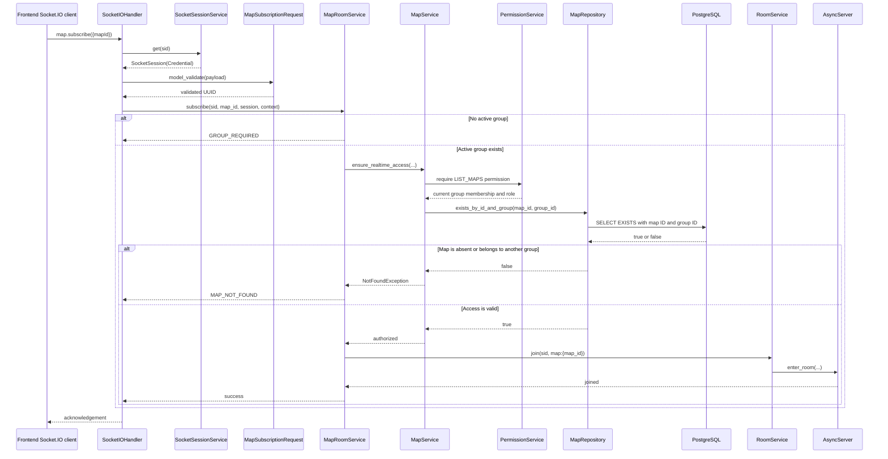
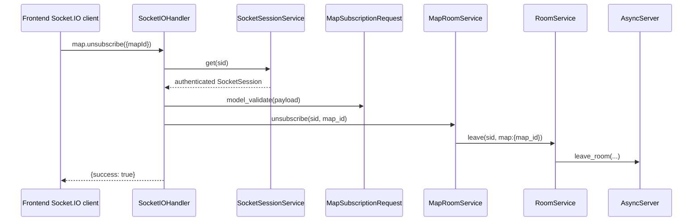
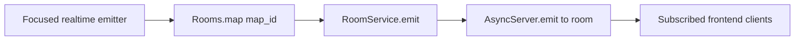

# Socket.IO Map Rooms: Data Flow

This guide describes how the Pleco backend creates Socket.IO connections, assigns
automatic rooms, authorizes map-room subscriptions, and routes room-scoped events.

The Socket.IO endpoint uses the default namespace `/` and transport path
`/api/v1/ws`. The existing native robot-status WebSocket at
`/api/v1/realtime/robots` remains a separate, unchanged flow.

## Component Map

| File | Responsibility |
|---|---|
| [`app/cmd/main.py`](../app/cmd/main.py) | Creates the realtime dependencies, registers Socket.IO handlers, and exports the combined Socket.IO/FastAPI ASGI application. |
| [`app/external/realtime/socket.py`](../app/external/realtime/socket.py) | Owns the single process-wide `AsyncServer`, CORS configuration, and ASGI wrapper. |
| [`app/external/realtime/handlers.py`](../app/external/realtime/handlers.py) | Handles Socket.IO connection lifecycle and the `map.subscribe` and `map.unsubscribe` events. |
| [`app/external/realtime/session.py`](../app/external/realtime/session.py) | Saves and retrieves the authenticated, typed session associated with a socket ID. |
| [`app/external/realtime/rooms.py`](../app/external/realtime/rooms.py) | Centralizes room names and wraps Socket.IO join, leave, and emit operations. |
| [`app/common/schemas/realtime.py`](../app/common/schemas/realtime.py) | Validates the public map subscription payload and internal socket session. |
| [`app/services/map_room.py`](../app/services/map_room.py) | Coordinates map-room authorization and room membership without querying the database directly. |
| [`app/services/map.py`](../app/services/map.py) | Applies map read permission and active-group ownership rules. |
| [`app/repository/map.py`](../app/repository/map.py) | Performs the group-scoped PostgreSQL existence query for the requested map. |
| [`app/core/rbac/permissions.py`](../app/core/rbac/permissions.py) | Resolves active group membership and enforces the existing `LIST_MAPS` permission policy. |

## Startup and ASGI Routing



`main.py` creates one `RoomService`, one `SocketSessionService`, and one
`MapRoomService` around the shared Socket.IO server. It then constructs a
`SocketIOHandler` and registers its event methods. No feature module creates a
second `AsyncServer`.

## Connection and Automatic Rooms

The frontend authenticates with the existing HTTP-only `access_token` cookie.
Socket.IO does not introduce a second token format.



If cookie validation or active-group membership validation fails, the connection
is rejected with the generic code `AUTHENTICATION_REQUIRED`. An authenticated
user without an active group can connect and joins only `user:{user_id}`.

The stored session contains the validated `Credential`, including the trusted
user ID and active group ID. Later events resolve identity from this server-side
session instead of trusting identity fields sent by the client.

## Map Subscription

The public event is:

```text
event: map.subscribe
payload: { "mapId": "<uuid>" }
```

Only the camel-case `mapId` field is accepted. Missing fields, malformed UUIDs,
snake-case alternatives, and additional fields produce `INVALID_PAYLOAD`.



The database query always combines `Map.id == map_id` with
`Map.group_id == credential.active_group_id`. Therefore, a map from another
group is indistinguishable from a missing map and returns `MAP_NOT_FOUND`.
Rooms are delivery groups, not authorization boundaries; authorization is
completed before `enter_room` is called.

Repeated subscriptions are idempotent because Socket.IO room membership does
not add the same socket twice.

## Map Unsubscription



Unsubscription removes only the calling socket from `map:{map_id}`. Its
automatic `user:{user_id}` and `group:{group_id}` memberships are unchanged.
Leaving a room more than once is treated as success.

## Outgoing Room-Scoped Events

No production map-telemetry emitter is connected in the current implementation.
When one is added, it should use the generic room API instead of calling
`socket_server.emit()` from a domain service:



This keeps audience selection in a focused emitter, transport mechanics in
`RoomService`, and domain services independent of Socket.IO.

## Acknowledgement and Failure Mapping

Successful subscribe and unsubscribe events return:

```json
{"success": true}
```

Failures return only a stable code:

```json
{"success": false, "error": "MAP_NOT_FOUND"}
```

| Code | Produced when |
|---|---|
| `AUTHENTICATION_REQUIRED` | The socket has no authenticated server-side session. Connection failures use the same generic code. |
| `INVALID_PAYLOAD` | `mapId` is missing, malformed, incorrectly named, or accompanied by unknown fields. |
| `GROUP_REQUIRED` | The authenticated credential has no active group. |
| `MAP_NOT_FOUND` | The map does not exist in the active group, including cross-group map IDs. |
| `MAP_ACCESS_DENIED` | Current membership or the `LIST_MAPS` permission no longer permits access. |
| `ROOM_OPERATION_FAILED` | Socket.IO could not complete a join or leave operation. |
| `INTERNAL_ERROR` | An unexpected server failure occurred. Internal exception details are not returned. |

## Disconnect Cleanup

When a socket disconnects, Socket.IO removes its session and all room
memberships. The disconnect handler records the lifecycle event but does not
persist presence or duplicate Socket.IO's cleanup behavior.

## Current Migration Boundary

The following path still uses the native WebSocket implementation and is not
connected to Socket.IO map rooms yet:

```text
Robot MQTT status
  -> RabbitMQ robot-status topic
  -> BotStatusService
  -> RobotStatusWebSocketManager
  -> /api/v1/realtime/robots
```

Future migration should introduce a focused realtime emitter after the domain
status update and target the appropriate centralized room name. The existing
native path should remain until equivalent Socket.IO delivery is implemented
and verified.
